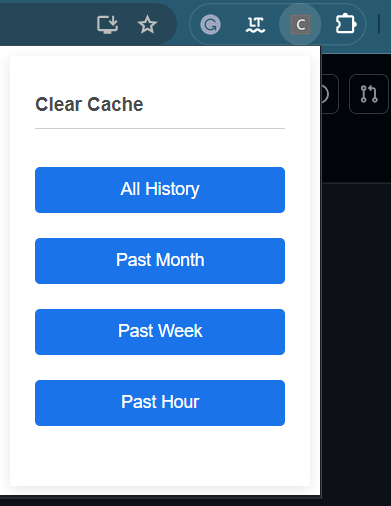

# Cache Cleaner

This is a JavaScript project that allows users to clear their browser cache from different time periods.

## Features

- Clear all cache history
- Clear cache history from the past month
- Clear cache history from the past week
- Clear cache history from the past hour

## How it works

The project uses the `chrome.browsingData.removeCache` method to clear the cache. When a user clicks one of the buttons, the corresponding event listener triggers the cache clearing for the specified time period.

After the cache is cleared, the date and time of the action is converted into a human-readable format and displayed in a paragraph with the id "lastCleared".

## Usage

To use this project:
1. Clone the repository to your local machine.
2. Navigate to `chrome://extensions/` in your Chrome browser.
3. Turn on developer mode (you can find this switch on the top right of the page).
4. Press “Load unpacked.”
5. Navigate to and select the folder that holds the cloned repository.
6. Once loaded, you should see the extension in your list of Chrome extensions. You can now test the extension by clicking on one of the buttons to clear the cache from the specified time period.

## Contributing

Pull requests are welcome. For major changes, please open an issue first to discuss what you would like to change.

## License

[MIT](https://choosealicense.com/licenses/mit/)